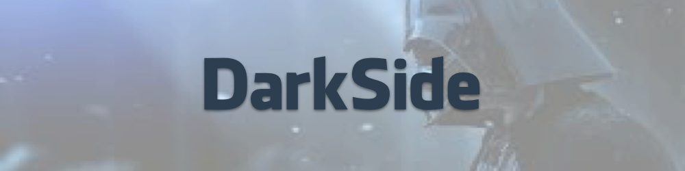
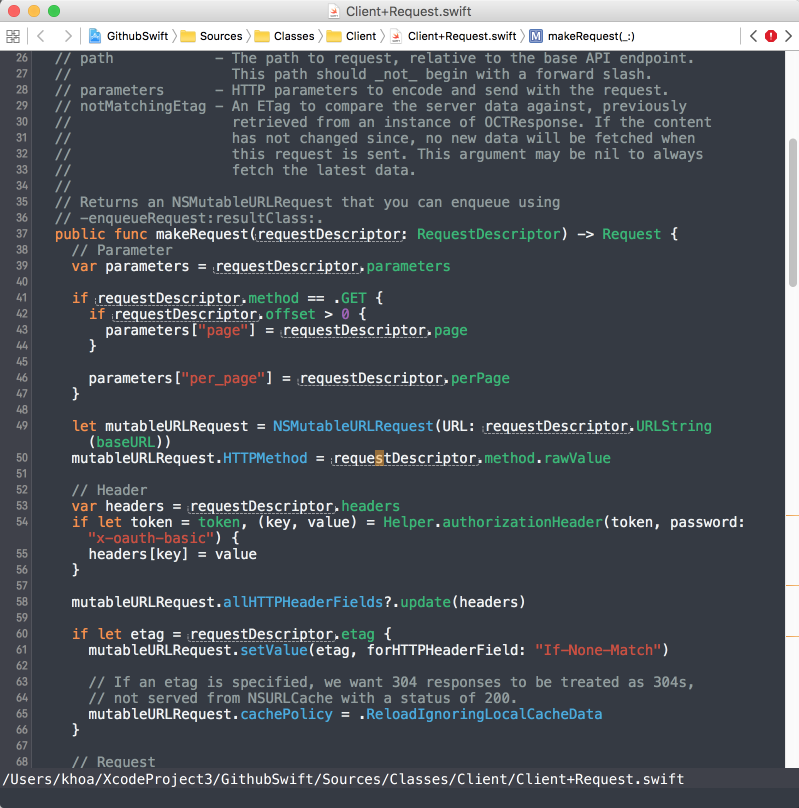

# DarkSide

A dark side theme using flat colors

[](https://travis-ci.org/onmyway133/Construction)
[](http://cocoadocs.org/docsets/Construction)
[](https://github.com/Carthage/Carthage)
[](http://cocoadocs.org/docsets/Construction)
[](http://cocoadocs.org/docsets/Construction)



### Xcode

```sh
curl -fsSL https://raw.githubusercontent.com/onmyway133/DarkSide/master/Xcode/install.sh | sh
```



## Palette

<table>
    <colgroup>
        <col>
        <col>
        <col>
    </colgroup>
    <tr>
        <td>Palette</td>
        <td>Name</td>
        <td>Value</td>
        <td>Color</td>
    </tr>
    <tr>
        <td>Background</td>
        <td>Ebony</td>
        <td>282C34</td>
        <td style="background-color:#282C34" />
    </tr>
    <tr>
        <td>Selection</td>
        <td>Gray</td>
        <td>3E4451</td>
        <td style="background-color:#3E4451" />
    </tr>
    <tr>
        <td>Cursor</td>
        <td>California</td>
        <td>F89406</td>
        <td style="background-color:#F89406" />
    </tr>
    <tr>
        <td>Plain Text</td>
        <td>Clouds</td>
        <td>ECF0F1</td>
        <td style="background-color:#ECF0F1" />
    </tr>
    <tr>
        <td>Keyword</td>
        <td>Hyper</td>
        <td>F57D2D</td>
        <td style="background-color:#F57D2D" />
    </tr>
    <tr>
        <td>Comment</td>
        <td>Asbestos</td>
        <td>7F8C8D</td>
        <td style="background-color:#7F8C8D" />
    </tr>
    <tr>
        <td>String</td>
        <td>Alizarin</td>
        <td>E74C3C</td>
        <td style="background-color:#E74C3C" />
    </tr>
    <tr>
        <td>Macro</td>
        <td>Sun Flower</td>
        <td>F1C40F</td>
        <td style="background-color:#F1C40F" />
    </tr>
    <tr>
        <td>Type Name</td>
        <td>Nepthritis</td>
        <td>27AE60</td>
        <td style="background-color:#27AE60" />
    </tr>
    <tr>
        <td>Other Type Name</td>
        <td>Peter River</td>
        <td>3498DB</td>
        <td style="background-color:#3498DB" />
    </tr>
    <tr>
        <td>URL</td>
        <td>Pumpkin</td>
        <td>D35400</td>
        <td style="background-color:#D35400" />
    </tr>
    <tr>
        <td>Number</td>
        <td>Wisteria</td>
        <td>8E44AD</td>
        <td style="background-color:#8E44AD" />
    </tr>
    <tr>
        <td>Attribute</td>
        <td>Torquoise</td>
        <td>1ABC9C</td>
        <td style="background-color:#1ABC9C" />
    </tr>
</table>

## Credit

- https://flatuicolors.com/
- https://atom.io/themes/one-dark-atom

## Author

Khoa Pham, onmyway133@gmail.com

## Contributing

We would love you to contribute to **Construction**, check the [CONTRIBUTING](https://github.com/onmyway133/Construction/blob/master/CONTRIBUTING.md) file for more info.

## License

**Construction** is available under the MIT license. See the [LICENSE](https://github.com/onmyway133/Construction/blob/master/LICENSE.md) file for more info.
